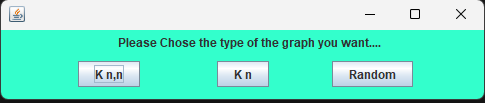
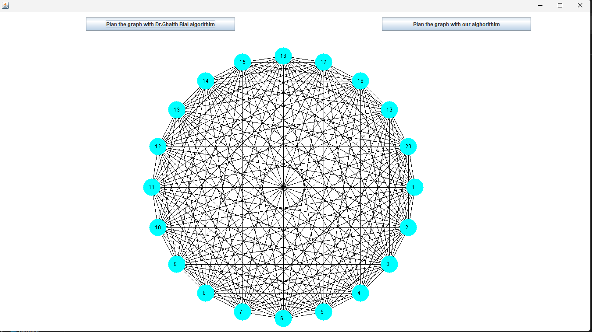
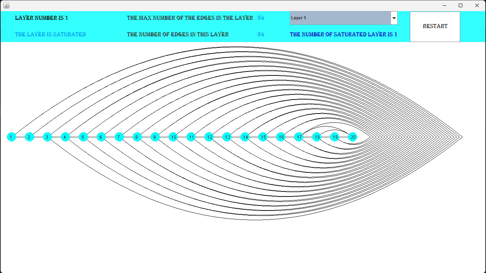
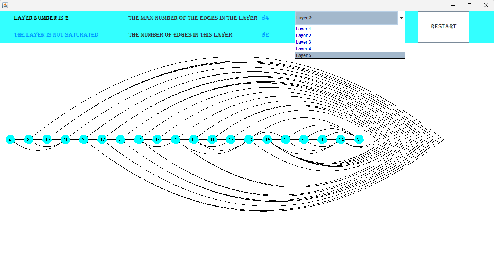

# Graph Thickness 📊

A **Java-based** application designed to analyze complex graphs and decompose them into planar layers to calculate the **Graph Thickness** using greedy algorithmic approaches.

## 📖 Overview
The **Thickness** of a graph $G$ is the minimum number of planar subgraphs into which $G$ can be partitioned. This application provides an interactive GUI to select various graph types and visualize the decomposition process step-by-step, making abstract graph theory concepts tangible.

## 🚀 Features
* **Graph Type Support:**
    * Complete Bipartite Graphs ($K_{m,n}$).
    * Complete Graphs ($K_{n}$).
    * Random Graph Generation.
* **Automated Decomposition:** Extract planar layers based on node degrees.
* **Dual Visualization:** Interactive Swing-based UI displaying both the original dense graph and the resulting simplified planar layers.
* **Layer Statistics:** Live tracking of layer status, including edge counts and saturation checks ($Saturated$ vs $Not Saturated$).

## 🧠 Decomposition Algorithms
The project includes two distinct processing implementations to compare efficiency and results:
1. **Dr. Ghaith Bilal's Algorithm:** The foundational implementation following the standard planar thickness theorem.
2. **Modified Processing Algorithm:** A version with adjustments to the processing logic.

## 📂 Project Structure
The code is organized into clean, modular packages for better maintainability:
* `com.ahmad.graph.thickness.model`: Data objects and geometric entities (Nodes, Edges).
* `com.ahmad.graph.thickness.engine`: Core decomposition logic and the two algorithm versions.
* `com.ahmad.graph.thickness.ui`: All Swing windows, custom canvases, and control panels.

## 🛠️ Prerequisites
* **Java Development Kit (JDK) 8** or higher.
* Any Java IDE (e.g., NetBeans, IntelliJ IDEA, or Eclipse).

## 📸 Visual Tour
Below are glimpses of the application in action (images available in the `/assets` directory):

### 1. Welcome & Generation
The starting point where users define the graph parameters.

### 2. Initial Visualization
The full, non-planar representation of the chosen graph.

### 3. Layer Extraction
The result of the decomposition, showing individual planar subgraphs.

